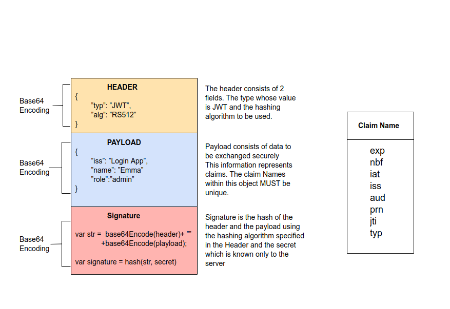

# Authentication & Authorization

           To know what a user can do, you first need to know who the user is. This is known as **authentication**. It is often done by asking for a set of credentials, such as username & password. Once verified, the client gets information about the identity and access of the user. **Authorization** in system security is the process of giving the user permission to access a specific resource or function. 

  

            To implement these **Identity and Access Management (IAM)** tasks easily, you can use **OAuth 2.0**, an authorization framework, and OpenID Connect (OIDC), a simple identity layer on top of it.
            
            
            OAuth encapsulates access information in an **access token**. In turn, OpenID Connect encapsulates identity information in an **ID token**. The authentication server can send these two tokens to the client application initiating the process. When the user requests a protected API endpoint, it must send the access token along with the request.
            
 

 

## Authentication techniques

1. Password-based authentication

It is the simplest way of authentication. It requires the password for the particular username. If the password matches with the username and both details match the system's database, the user will be successfully authenticated.

2. Passwordless authentication

In this technique, the user doesn't need any password; instead, he gets an OTP (One-time password) or link on his registered mobile number or phone number. It can also be said OTP-based authentication.

3. 2FA/MFA

2FA/MFA or 2-factor authentication/Multi-factor authentication is the higher level of authentication. It requires additional PIN or security questions so that it can authenticate the user.

4. Single Sign-on

Single Sign-on or SSO is a way to enable access to multiple applications with a single set of credentials. It allows the user to sign-in once, and it will automatically be signed in to all other web apps from the same centralized directory.

5. Social Authentication

Social authentication does not require additional security; instead, it verifies the user with the existing credentials for the available social network.

6. Biometrics, such as facial or voice recognition, or fingerprints

##  Authorization Techniques

1. Role-based access control

Role-based access control technique is given to users as per their role or profile in the organization. It can be implemented for system-system or user-to-system.

2. JSON web token

JSON web token or JWT is an open standard used to securely transmit the data between the parties in the form of the JSON object. The users are verified and authorized using the private/public key pair.

## JWT (JSON Web Token)

*   **What is JWT?**  JSON Web Token (_**JWT**_) is a  type of **bearer** token  representing **claims** to be transferred between two parties. The claims in a **_JWT_** are encoded as a  JSON object that is used as the payload of a JSON Web Signature (_**JWS**_) structure or as the plaintext of a JSON Web Encryption (_**JWE**_) structure, enabling the  claims to be digitally signed or integrity protected with a Message Authentication Code (MAC) and/or encrypted.  

*   **JWT Signature:** To create the _**JWT signature**_ you  take the encoded **header**, the encoded **payload**, a **secret**, the algorithm specified in the header and sign that. _The algorithm is part of the JWT header, for example :_
    *   **RS256**  (RSA Signature with [SHA-256](https://en.wikipedia.org/wiki/SHA-256))   is an [asymmetric algorithm](https://en.wikipedia.org/wiki/Public-key_cryptography) which means that there are two keys: one public and one private (secret). Auth Server has the secret key, which is used to generate the signature, and the consumer of the JWT has the public key, which is used to validate the signature.
    *   **HS256**   ([HMAC](https://en.wikipedia.org/wiki/HMAC) with SHA-256)  is a [symmetric algorithm](https://en.wikipedia.org/wiki/Symmetric-key_algorithm) which means that there is only one secret key, shared between the two parties. The same key is used both to generate the signature and to validate it. Special care should be taken in order for the key to remain confidential
    *   The most secure practice is to use **RS256**. Some of the reasons are:
        *   With RS256 you are sure that only the holder of the private key Auth Server can sign tokens, while anyone can check if the token is valid using the public key.
        *   Under HS256, if the secret key is compromised (e.g. by the application) you would have to re-deploy the API with the new secret.
        *   With RS256 you can request a token that is valid for multiple audiences.
        *   With RS256 you can implement key rotation without having to re-deploy the API with the new secret.

 

## OAuth 2

*   **OAuth 2** – OAuth is an open standard for authorization   specified in the [OAuth 2.0 Authorization Framework](http://tools.ietf.org/html/rfc6749)  . The purpose of OAUTH is to allow access to some resource by third parties without having to share client username/password (credentials). This access can then be selectively granted and revoked by the client at any time. It establishes a trust relationship between the client and the third party. OAuth achieves this by introducing an authorization layer and separating the role of the client from that of the resource owner. OAuth defines four primary roles:

    *  **Resource owner** (RO): The entity that can _grant access_ to a **protected resource** exposed by an API.  Typically this is the end-user.  
    *  **Client**: The mobile application, web site, and so on, that wants to access a **protected resource** on behalf of the **resource owner**.
    *  **Authorization server** (AS): The Security Token Service (STS) or OAuth server that issues **tokens**.  The authorization server will typically have two primary URLs, one for the authorization request and one for applications to use to grant access tokens. These are usually something such as:  
            *https://authorization-server.com/authorize*  
            **https://authorization-server.com/token**
    *  **Resource server** (RS):   The server _hosting_ the **protected resources**. This is the _API_ you want to access.  Resource servers rely on some kind of information to decide whether access to a protected resource should be _granted_. For RESTful-based resource servers, that information is usually carried in a _security token_, typically sent as a **bearer token** along with every request to the server. Web applications that rely on a session to authenticate users usually store that information in the user’s session and retrieve it from there for each request    

*   **Bearer Token** A security token with the property that any party in possession of the token (a "bearer") can use the token in any way that any other party in possession of it can. Using a bearer token does not require a bearer to prove possession of cryptographic key material (proof-of-possession).  
    *   **Access token** is the token provided by the authorization server that provide access to Protected Resources. The token has a corresponding duration of access, scope, and potentially other information the server needs.  

