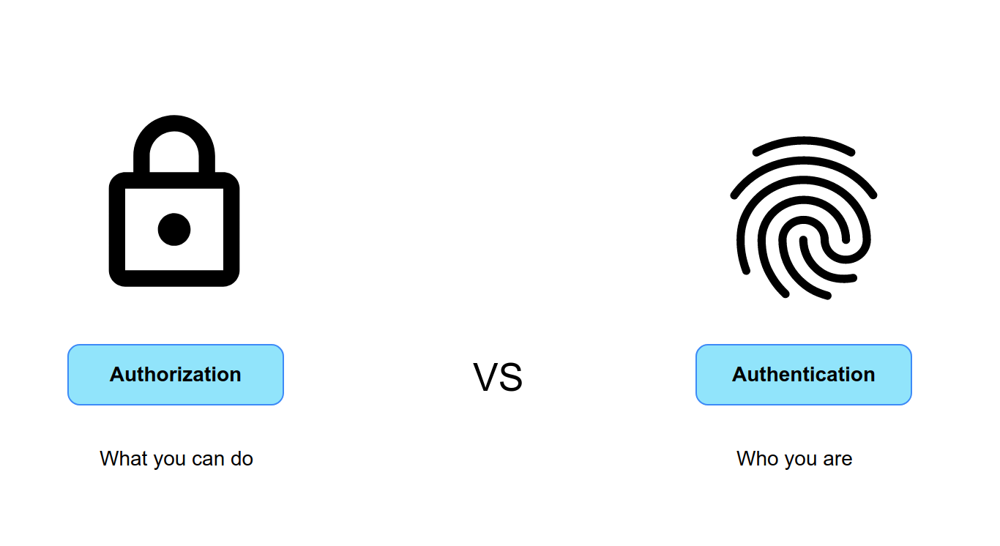
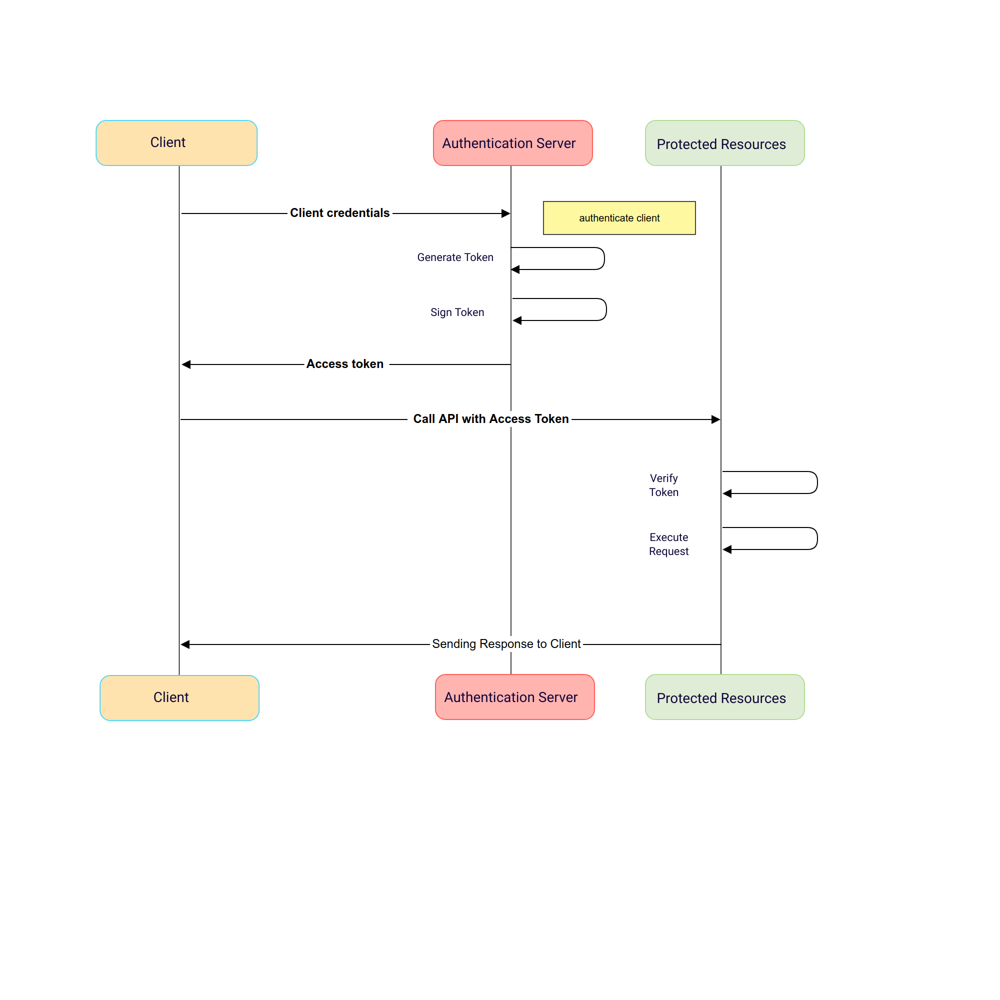
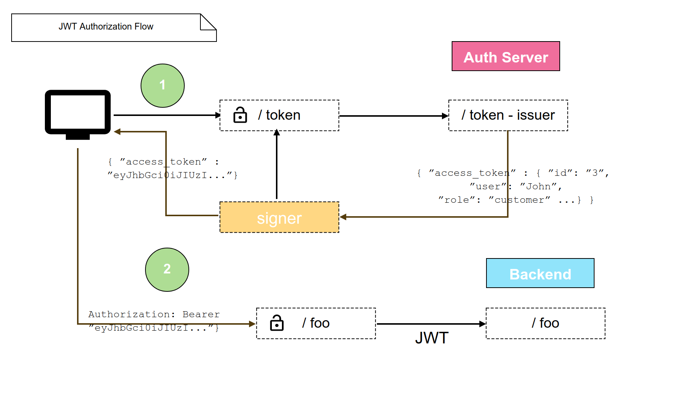

# Authentication & Authorization

           To know what a user can do, you first need to know who the user is. This is known as **authentication**. It is often done by asking for a set of credentials, such as username & password. Once verified, the client gets information about the identity and access of the user. **Authorization** in system security is the process of giving the user permission to access a specific resource or function. 

  

            To implement these **Identity and Access Management (IAM)** tasks easily, you can use **OAuth 2.0**, an authorization framework, and OpenID Connect (OIDC), a simple identity layer on top of it.
            
            
            OAuth encapsulates access information in an **access token**. In turn, OpenID Connect encapsulates identity information in an **ID token**. The authentication server can send these two tokens to the client application initiating the process. When the user requests a protected API endpoint, it must send the access token along with the request.
            
 

 

